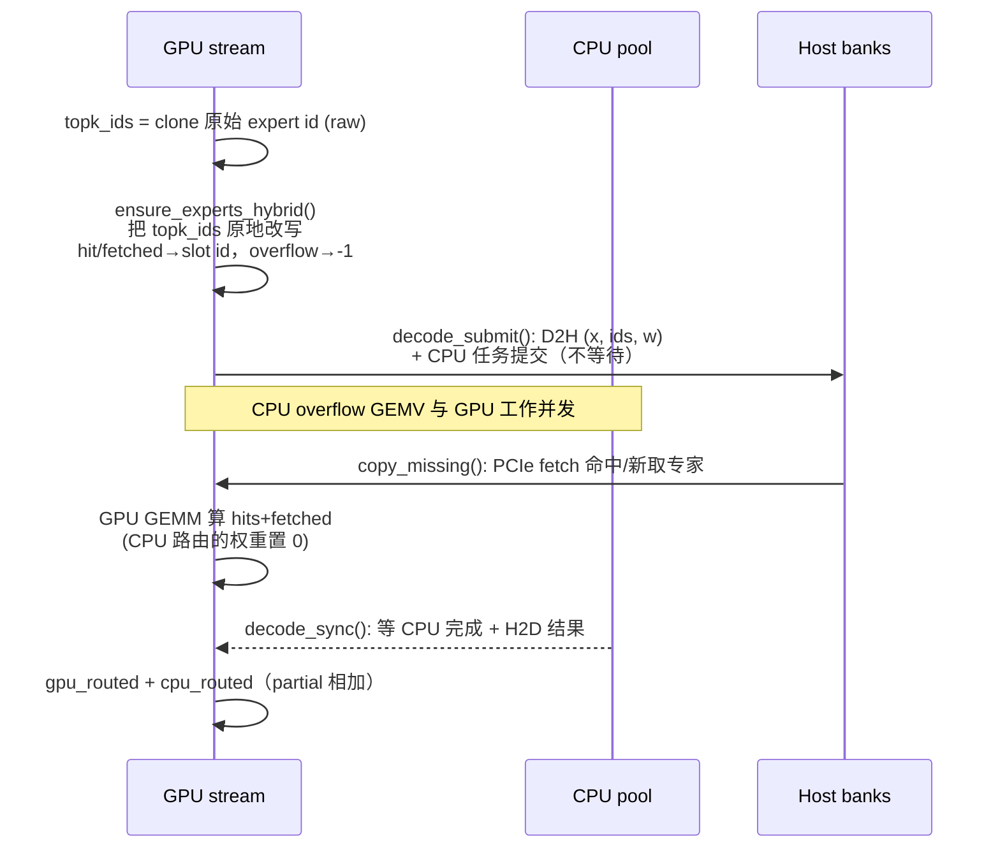

> 目标：讲清楚 FreeToken（FlashML 的开源边端 MoE 推理引擎）里「带宽比」这一核心概念的来龙去脉——它如何从硬件实测出发，决定 hybrid 后端每一步里哪些专家走 PCIe 搬上 GPU、哪些留在 CPU 直接算，最终让 PCIe 搬运与 CPU 计算**刚好同时结束**，实现完美 overlap。

## 目录

1. [背景：MoE 卸载与两条计算路径](#背景moe-卸载与两条计算路径)
2. [第一层带宽比：选后端](#第一层带宽比选后端)
3. [第二层带宽比：hybrid 的 fetch 拆分](#第二层带宽比hybrid-的-fetch-拆分)
4. [数学推导：为什么是 pcie_bw / cpu_bw](#数学推导为什么是-pcie_bw--cpu_bw)
5. [实测版本：overlap 带宽取代假设](#实测版本overlap-带宽取代假设)
6. [代码全链路](#代码全链路)
7. [总结](#总结)

---

## 背景：MoE 卸载与两条计算路径

MoE（Mixture-of-Experts）模型的专家权重总量巨大（290B+ 级别的模型，专家参数占大头），消费级显卡显存放不下。FreeToken 的做法是把专家权重存在 **pinned host memory**（CPU 内存），按需流式搬运到 GPU 的 slot cache 里做 LRU 缓存。

decode 阶段每一步只路由到一小撮专家（top_k 个）。当某步的专家**不在** GPU cache 里（miss）时，有两条路可选：

```
路径 A（offload）：  host 内存 ──PCIe fetch──> GPU slot cache ──GPU GEMM──> 结果
路径 B（cpu）：      host 内存 ──CPU GEMV(直接读)──────────────> 结果
```

- **PCIe fetch**：把专家经 PCIe 总线搬到 GPU，用 GPU 的算力算 GEMM。
- **CPU compute**：CPU 直接从 pinned host 内存读专家（不走 PCIe），用自己的 SIMD（AVX2/AVX512/VNNI）算 GEMV。

两条路**并行执行**，但**争抢同一个 host DRAM 带宽**。带宽比（bandwidth ratio）就是用来回答：这两条路的带宽谁高谁低，以及每一步的 miss 专家该按什么比例分给它们。

---

## 第一层带宽比：选后端

`ft bench bw` 会测出两个**真实内核**的带宽（不是线性 memcpy 的理论值），然后按一个比值判定用哪个后端：

```
ratio = cpu_bw / pcie_bw

ratio > 2.0   →  hybrid     # CPU 算专家够快，值得用 CPU
ratio <= 2.0  →  offload    # CPU 太慢，老老实实搬上 GPU 算
```

对应源码 `moe/benchbw.py:586` 的 `recommend()`：

```python
def recommend(cpu_bw_gbs, pcie_bw_gbs, threshold=2.0):
    """hybrid iff CPU bandwidth exceeds threshold x PCIe bandwidth, else offload."""
    return "hybrid" if cpu_bw_gbs > threshold * pcie_bw_gbs else "offload"
```

这里测的两个带宽是真实 workload：

| 量 | 含义 | 测量函数 |
|---|---|---|
| `cpu_moe_gbs` | CPU MoE GEMV 实际带宽（bs=1 decode，读 pinned banks） | `measure_cpu_moe_bw()` |
| `pcie_gather_gbs` | `fast_index_copy` 把专家从 host 搬到 GPU 的实际带宽 | `measure_pcie_gather_bw()` |

**直觉**：如果 CPU 读内存算专家的速度是 PCIe 搬运速度的 2 倍以上，说明「留在 CPU 算」明显更快，值得引入 hybrid 的复杂度；否则 PCIe 搬上 GPU 用 GPU 算更划算，选更简单的 offload。

> 这个 ratio 受**专家量化格式**主导（bf16/nvfp4/mxfp4/ds_fp4 的 CPU 内核带宽差异很大），所以 benchbw 的默认模式是按 dtype 各测一遍（`--dtype`），引擎启动时按模型的专家格式去 profile 里查结果。

---

## 第二层带宽比：hybrid 的 fetch 拆分

一旦选了 hybrid，还差最后一步：**每个 decode step 的 miss 专家里，多少走 PCIe、多少留 CPU？**

hybrid 的 GPU slot cache 是**满配**的（和 offload 一样大），但每个 (layer, step) 会**封顶** PCIe fetch 的数量：cache 命中的 + 新 fetch 的专家在 GPU 算，剩下的 overflow miss 在 CPU 算，最后两个 partial 结果**相加**（见 `moe/cpu_offload.py:33` 的 `HybridMoeBackend` 注释）。

这个「fetch 比例」就是第二层带宽比，核心公式在 `moe/offload_cache.py` 的 `hybrid_fetch_fraction` 字段注释里：

> Perfect fetch/compute overlap wants fetched : cpu-computed misses = `pcie_bw : (cpu_bw - pcie_bw)`，即 fetch `pcie_bw / cpu_bw` 比例。

---

## 数学推导：为什么是 pcie_bw / cpu_bw

设某 decode step 有 **M** 个 miss 专家，每个专家 **E** 字节，fetch 比例 **f**（走 PCIe），则 CPU 算 **(1-f)**。

在**满争用（full-contention）模型**下，假设 PCIe DMA 和 CPU 读共享同一个 DRAM 总带宽，DMA 抢走一块后 CPU 实际只剩 `cpu_bw - pcie_bw`：

```
PCIe 搬 f·M·E 字节的用时：   T_pcie = f·M·E / pcie_bw
CPU  算 (1-f)·M·E 字节用时： T_cpu  = (1-f)·M·E / (cpu_bw - pcie_bw)
```

完美 overlap 要求两边**同时做完**（谁都不 idle），令 `T_pcie = T_cpu`：

```
    f / pcie_bw  =  (1-f) / (cpu_bw - pcie_bw)
⟹  f·(cpu_bw - pcie_bw)  =  (1-f)·pcie_bw
⟹  f·cpu_bw  =  pcie_bw
⟹  f = pcie_bw / cpu_bw
```

**结论：fetch fraction = `pcie_bw / cpu_bw`。**

这就是引擎里 `_resolve_hybrid_fetch`（`engine.py:594`）注释说的：

> fetching a pcie_bw / cpu_bw fraction of each decode step's misses

---

## 实测版本：overlap 带宽取代假设

上面的 full-contention 模型有个隐患：它假设 CPU 内核**本来就把 DRAM 吃满了**。但如果 CPU GEMV 实际没饱和 DRAM，DMA 只会吃掉「剩余」带宽，用 `cpu_bw - pcie_bw` 会**过度惩罚** CPU 一方。

所以 benchbw 不做假设，而是**直接并发跑**两个内核（`benchbw.py:526` `measure_overlap_bw`），测出真实的：

```
cpu_ov  = 并发时 CPU MoE 实际带宽
pcie_ov = 并发时 PCIe gather 实际带宽
```

然后 fetch fraction 取：

```
f = pcie_ov / (pcie_ov + cpu_ov)
```

（`bench_profile.py:135` `load_hybrid_fetch_fraction`）

**推导同理**：令 `T_pcie = f·M·E / pcie_ov` 与 `T_cpu = (1-f)·M·E / cpu_ov` 相等：

```
f / pcie_ov = (1-f) / cpu_ov
⟹  f = pcie_ov / (pcie_ov + cpu_ov)
```

**两个公式自洽**：若 full-contention 成立，`cpu_ov ≈ cpu_bw - pcie_bw` 且 `pcie_ov ≈ pcie_bw`，代入后 `f = pcie_bw / cpu_bw`——与简单模型完全一致。实测版本是它的**无假设推广**。

`benchbw.py` 报告里那一行 `hybrid fetches p% of misses` 就是这么来的（`benchbw.py:806`）：

```python
print(f"       overlapped: CPU-MoE {c_ov:.1f} + PCIe {p_ov:.1f} GB/s "
      f"-> hybrid fetches {p_ov / (p_ov + c_ov):.1%} of misses")
```

---

## 代码全链路

### 1. 启动时：把 fraction 装进 cache

`engine.py:591` `_resolve_hybrid_fetch`：`--moe-hybrid-max-fetch -1`（auto）时，从 profile 读 fraction 并设到 cache 上：

```python
fraction = load_hybrid_fetch_fraction(cache.quant_format, gpu_name=gpu_name)
if fraction is None:            # 没有可用 profile → 退化为固定 cap 1
    cache.hybrid_max_fetch = 1
    return
cache.hybrid_fetch_fraction = fraction   # 之后每步按 fraction 拆 miss
```

### 2. 每步 decode：ensure + 拆分 + merge

`layers/moe.py:325` `_decode_hybrid` 是 hybrid decode 的核心，完整数据流：



关键代码（`layers/moe.py:341` 起）：

```python
raw = topk_ids.clone()                       # 原始 expert id 留给 CPU 侧
cache.ensure_experts_hybrid(self.layer_id, topk_ids)  # → slot 或 -1
on_gpu = topk_ids >= 0

# CPU 侧：GPU 分配的 route 置 -1（C++ 内核跳过 id<0）
cpu_ids = torch.where(on_gpu, raw.new_full((), -1), raw).contiguous()
pending = executor.decode_submit(self.layer_id, hidden_states, topk_weights, cpu_ids)

cache.copy_missing()                          # PCIe fetch（与 CPU 计算并发）
gpu_slots = topk_ids.clamp_min(0)             # -1 → slot 0（权重已置 0）
gpu_w = torch.where(on_gpu, topk_weights, topk_weights.new_zeros(())).contiguous()
gpu_routed = self._expert_gemm(...)           # GPU 算 hits + fetched

cpu_routed = executor.decode_sync(pending)    # 等 CPU 完成 + H2D
return gpu_routed + cpu_routed                # 两个 partial 求和
```

**每个 route 只被算一次**：GPU 侧把 CPU 分配的 route 权重置 0，CPU 侧把 GPU 分配的 route id 置 -1，两者天然互补，无重复计算。

### 3. ensure_experts_hybrid 内核：fraction 落到整数

`offload_kernels.py:291` 的 `_ensure_experts_hybrid_kernel` 在**设备端**（CUDA graph 内，无法 host 往返）用 Q16 定点算出本步 fetch 数量：

```python
# Phase 1: 数 miss
num_missing = tl.sum(is_missing.to(tl.int32))

# 带宽匹配拆分：fetch time ∝ F*(1-frac)，CPU time ∝ (M-F)*frac
# 平衡点在 F = frac*M；取整数邻居里 max 侧更小者
if fetch_frac_q16 > 0:
    lo = (num_missing * fetch_frac_q16) >> 16
    cost_lo = tl.maximum(lo * ((1 << 16) - fetch_frac_q16), (num_missing - lo) * fetch_frac_q16)
    cost_hi = tl.maximum((lo + 1) * ((1 << 16) - fetch_frac_q16),
                         (num_missing - lo - 1) * fetch_frac_q16)
    max_fetch = tl.where(cost_lo <= cost_hi, lo, lo + 1)
num_fetch = tl.minimum(num_missing, max_fetch)
```

这里 `cost(F) = max(F·(1-frac), (M-F)·frac)` 是归一化的「较慢一侧」用时：`F·(1-frac)` ∝ PCIe fetch 时间，`(M-F)·frac` ∝ CPU 计算时间（都除了 `pcie_ov+cpu_ov`）。取 `max` 是因为 overlap 的总时长由较慢一方决定，选让 `max` 最小的整数邻居，就是最接近「同时完成」的拆法。

然后 Phase 2 只给 `num_fetch` 个 miss 分配 slot（LRU 淘汰），Phase 3 把 expert id 重写为 slot id 或 -1。

---

## 总结

FreeToken 里的「带宽比」是**两个层面、同一个思想**：

| 层 | 比值 | 作用 |
|---|---|---|
| 选后端 | `cpu_bw / pcie_bw` | 比值 > 2 才值得用 hybrid，否则 offload |
| 拆 fetch | `pcie_ov / (pcie_ov + cpu_ov)` | hybrid 每步 miss 里走 PCIe 的比例 |

它的本质是**带宽匹配调度**：PCIe 搬运和 CPU 计算共享 DRAM 带宽，谁都不该比谁先做完。fetch fraction 取 `pcie_bw / cpu_bw`（实测并发版 `pcie_ov / (pcie_ov+cpu_ov)`）时，两边刚好同时收尾，overlap 完美、无 idle。

这套逻辑贯穿三层代码：

- **测**：`moe/benchbw.py` —— 离线测真实内核带宽 + 并发带宽，写 `benchbw.json`。
- **读**：`moe/bench_profile.py` —— torch-free 地读 profile，供引擎启动时查 fraction。
- **用**：`engine.py`（装 fraction）+ `offload_kernels.py`（设备端按 fraction 拆 miss）+ `layers/moe.py`（submit/copy/GEMM/sync/merge 的 overlap 编排）。

一个「带宽比」小概念，撑起了 FreeToken 在消费级硬件上跑 290B 级 MoE 模型的半壁江山。
